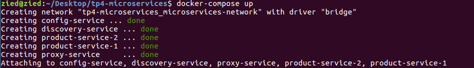
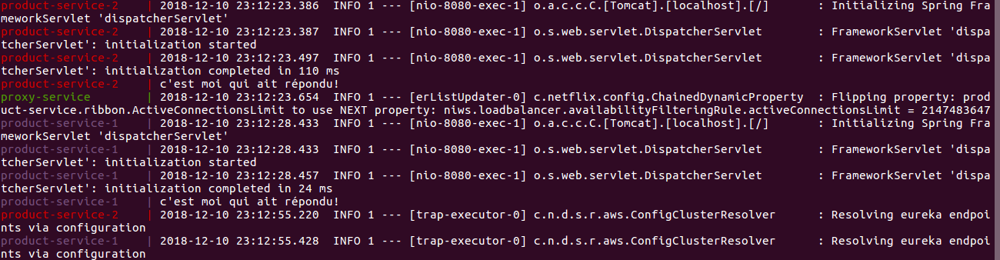

# Spring Cloud Microservices
## Description
This project is an implementation of a microservices architecture. It demonstarates how we can use a Discovery server, a Gateway service, a Config server and a spring boot application to set up this architecture.
This repository also indicates the steps to dockerize each service.

## Services description:
In this application, we used Eureuka as a discovery server and Zuul Proxy as a Gateway service.

Below, is a bried explanantion of each service used in this application.
* **Config server:** <br>
To keep the Properties file centralized and shared by all Microservices, we will create a config server which is itself a Microservice, and manages all microservices properties files and  those files are versioned controlled; any change in the properties will automatically publish to all microservices without restarting the services

* **Discovery server: (Eureuka)** <br>
As containers have dymanic IP addresses, we need a manager service to track all instances of a service. So when a container is craeted, it registers itself to the manager and the manager keeps the track of the instances; if a service is removed, the manager removes it from the manager's service registry. If other services need to communicate with each other, it contacts a discovery service to get the instance of another service.

* **gateway service: (Zuul)** <br>
A Gateway service, which is internet facing, allows the client to call only one endpoint and it delegates the call to an actual microservice, and all the authentication or security checking will be done in the gateway service.

* **Components service: (Product service)** <br>
They are business features which can be managed or updated independently. In our case it is a __Product Service__, main service, which offers a REST API to list a list of products.


## Architecture

<p align="center">
  
</p>
 

## Prerequisite

* Install [Docker](https://docs.docker.com/install/linux/docker-ce/ubuntu/#set-up-the-repository) : Docker is a tool designed to make it easier to create, deploy, and run applications by using containers. Containers allow a developer to package up an application with all of the parts it needs, such as libraries and other dependencies, and ship it all out as one package.


## Steps
1. [Clone the repo](#1-clone-the-repo)
2. [Create the Dockerfiles](#2-Create-the-Dockerfiles)
3. [Build the Dockerfiles](#3-Build-the-docker-files)
4. [Create and Run the docker-compose file](#4-create-and-run-the-docker-compose-file)
5. [Test the application](#5-Test-the-application)


### 1. Clone the repo

Clone this repository. In a terminal, run:

```
$ git clone https://github.com/ziedYazidi/spring-cloud-microservices.git
```

### 2. Create the Dockerfiles:
A Dockerfile contains a set of instructions that allow to build images automatically.
It is a text document that contains all the commands a user could call on the command line to assemble an image.

All the docker files of the spring boot applications have almost the same structure as below:
```
FROM maven:3.3.9-jdk-8-alpine
MAINTAINER ziedyazidi
RUN apk --no-cache add netcat-openbsd
COPY target/discovery-service-0.0.1-SNAPSHOT.jar /opt/lib/
ADD wait-for-it.sh /wait-for-it.sh
RUN chmod 755 /wait-for-it.sh
EXPOSE 8761
```

Our image uses a <em>**maven:3.3.9-jdk-8-alpine**</em> image as base image. We copied the jar of the application inside the image.
The script named **wait-for-it.sh** is a script that indicates to a container to wait from another container before to start. In effetc ,the problem is all the docker container will start together (When using docker-compose) if we don't use this script, but as per your architecture, the config-service needs to start first, then the discovery-service(eureka).

I used the script made by vishnubob. Please check this[ repository](https://github.com/vishnubob/wait-for-it) for more explanation.
### 3. Build the docker files
Before building the Dockerfiles, we need make some configurations in our services.
we need to set the default zone for the Eureuka clients to makes sure that they automatically register to discovery-service.
Now we can to run a <code> mvn clean install</code> maven task to install the package into the local repository, for use as a dependency in other projects locally. (Generates the .jar file) <br>
PS: For the product-service clean install task, we need the config-service to be running to be able to execute this task.
So we need to add this propety to **product-service.properties** and **proxy-service.properties** in the **config-service** application.
```
eureka.client.serviceUrl.defaultZone=http://discovery-service:8761/eureka/
```

Now we can build the Dockerfiles to create the docker images. To do so, we need to navigate to each service directory and execute the following command: <br>
```
docker build -t serviceName .
```

### 4. Create and Run the docker-compose file
Docker compose is a tool for defining and running multi-container Docker applications.
We need to create a <code>docker-compose.yml</code> file, add the sections that configure each container and add a network.

This is an that illustrates the configuration for the discovery-service.
```
discovery-service:
        image: discovery-service
        container_name: discovery-service
        expose:
            - 8761
        ports:
            - "8761:8761"
        depends_on:
            - config-service
        environment:
            SPRING_APPLICATION_JSON: '{"spring": {"cloud": {"config": {"uri": "http://config-service:8888"}}}}'
            EUREKA_INSTANCE_PREFER_IP_ADDRESS: "false"
        entrypoint: /wait-for-it.sh config-service:8888 -t 300 --
        command: java -jar /opt/lib//discovery-service-0.0.1-SNAPSHOT.jar
        networks:
            - microservices-network
```
In this example, we used the discovery-service image, we exposed the port 8761, we used the SPRING_APPLICATION_JSON environment variable to enable the use of the config-service container as a configuration repository.
With **depends_on** we expressed the dependency between services.
We also indicated with <code>entrypoint</code> the script execution **wait-for-it.sh** and with the <code>command</code> the jar execution.

The configuration for the other containers are almost the same.

To run the docker compose file, use the following command:
```
docker-compose up
```

We can see that the containers have started
<p align="center">
  
</p>

### 5. Test the application
As a result, we can the the proxy-service, the first and the second product-services have be successefully registered to the discovery-service
<p align="center">
  
</p>

For the finish, use your favorite result to call the proxy throught this URL: <code>http://localhost:9999/product-service/messages</code>

If you query this URL several times, we will notice that the display "c'est moi qui ait repondu" will be displayed on the consoles of the two  instances respectively, in turn.
This proves that the messages are beeing load balanced automatically by the Proxy-service Zuul.

<p align="center">
  
</p>

## References
* [Lilia Sfaxi](https://insatunisia.github.io/TP-eServices/tp4/) for the microservices architecture implementation. 
* [DZONE](https://dzone.com/articles/buiding-microservice-using-springboot-and-docker) for the dockerization
* [vishnubob](https://github.com/vishnubob/wait-for-it)

and of course STACKOVERFLOW.